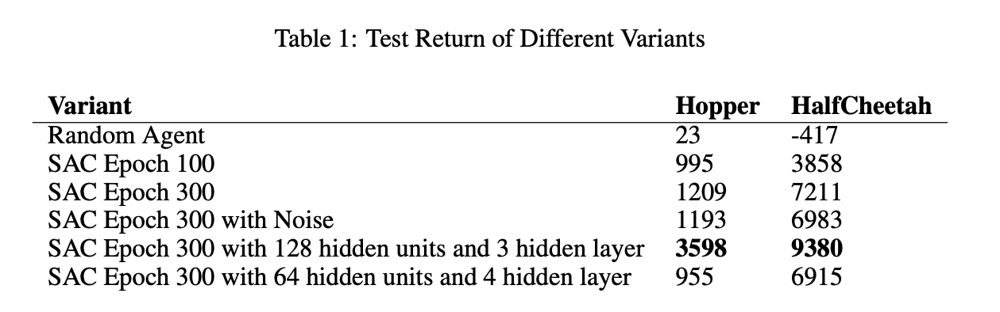
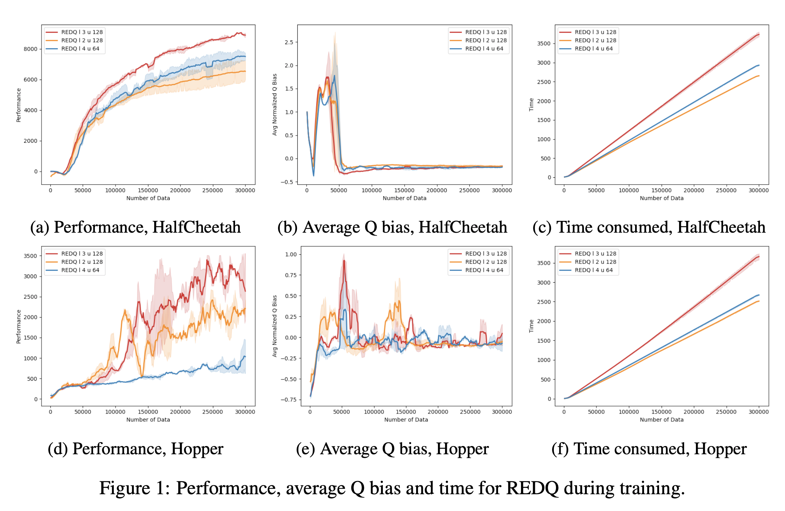
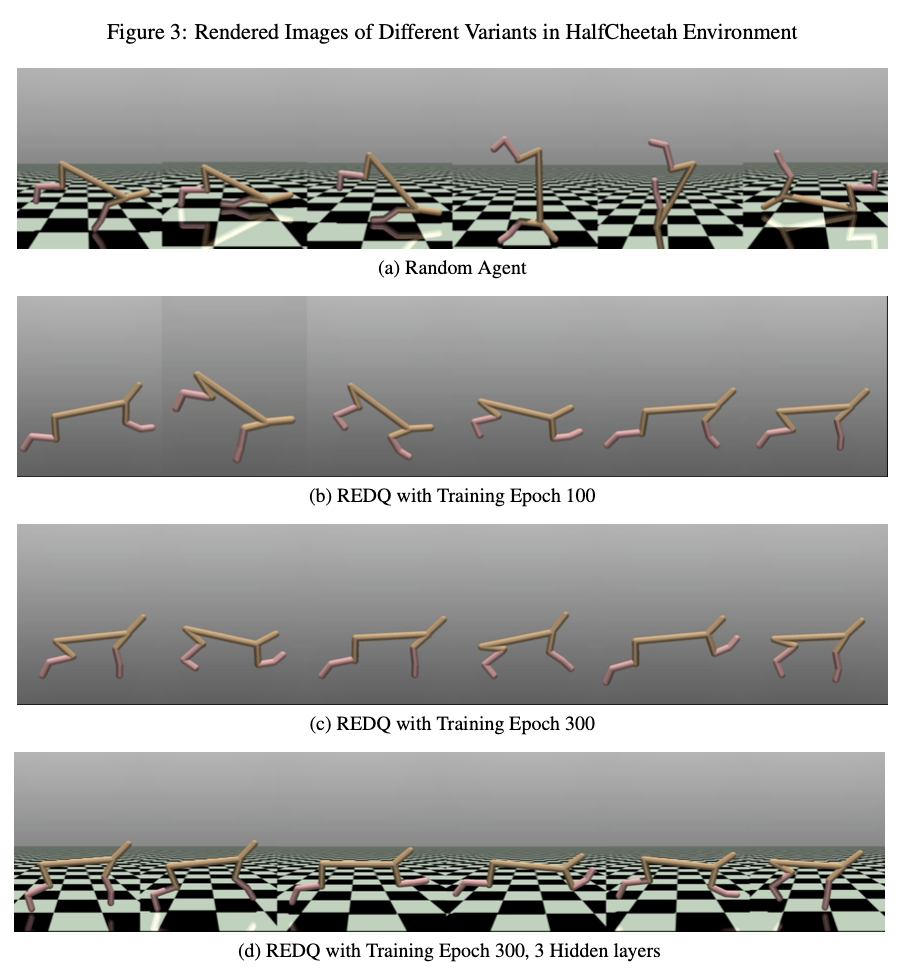
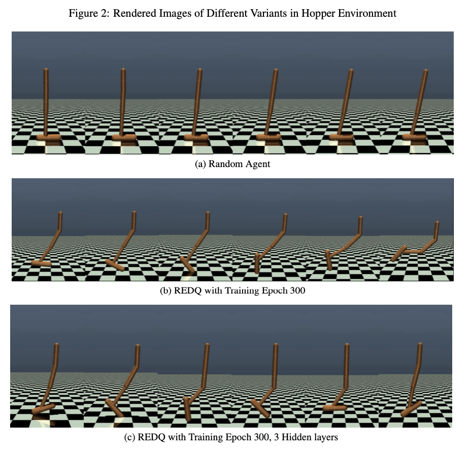

# RL-Final-REDQ
Course project: Reinforcement Learning

This report investigated the performance of REDQ Chen et al. (2021) with five different trained variants on two MoJoCo (Todorov et al., 2012; Brockman et al., 2016) environments: HalfCheetah and Hopper. Six REDQ variants are trained to aim at investigating the following aspects of model training: 1)Training data steps 2)Action noise in evaluation phrase 3)Network structure - deeper network & more parameters
## Environment & Dependency
To setup the MoJoCo environment and related denpendencies please reffer to this github page: [https://github.com/YumengggZhang/Reinforcement-Learning-Final-Project](https://github.com/YumengggZhang/Reinforcement-Learning-Final-Project)

## How to Run
- run experiment/redq_sac_part2 for sequentially training REDQ agent rendering different hyper parameters
- experiment/train_with_save.py for training REDQ agent and saving checkpoints at epoch 0,100,300 (this can be adjusted)
- experiment/train_redq_sac_reset.py for training REDQ agent and reset the parameters after 150 epochs

## Results and Plots
The six variants are:
- the randomized agent taking random actions at every step;
- REDQ with 128 hidden units and 2 hidden layers trained for 100 epochs.During the evaluation, this agent follows the deterministic policy;
- REDQ with 128 hidden units and 2 hidden layers trained for 300 epochs.During the evaluation, this agent follows the deterministic policy;
- REDQ with 128 hidden units and 2 hidden layers trained for 300 epochs.During the evaluation, this agent has 30% probability of taking random action and following deterministic
policy at other times;
- REDQ with 128 hidden units and 3 hidden layers trained for 300 epochs.During the evaluation, this agent takes the best action according to its policy. This variant keeps the identical
hidden unit number 128 but with an extra layer with more parameters;
- REDQ with 64 hidden units and 4 hidden layers trained for 300 epochs. During the evaluation, this agent takes the best action according to its policy. This variant keeps the same
total number of parameters but with a deeper network structure

